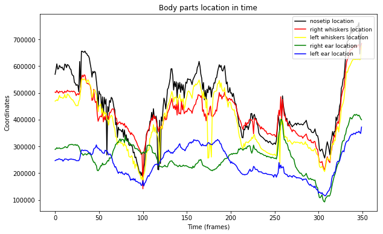
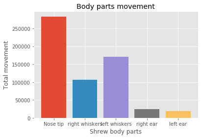
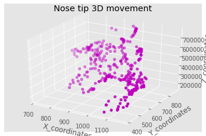

# Hunting-Sense

## Overview
The Etruscan shrew (*Suncus etruscus*) is considered the smallest extant mammal, with an average mass of less than 2g [1]. Due to its extremely small size, the Etruscan shrew has a large surface-to-volume ratio, resulting in significant heat loss to the environment. To maintain a constant body temperature, it must consume about 1.5-2.9 times its own body weight in food per day, making it the mammal with the highest mass-specific energy consumption [2].

This research project was part of my MSc in computational ecology, and it aims to understand the dominant sense used by the Etruscan shrew to find prey during the summer. To achieve this, a 3D markerless pose estimation tool based on transfer learning with deep neural networks is employed. This tool enables the tracking and modeling of the shrew's movement, allowing for the analysis of behaviors such as foraging and a comparison between different seasons when the shrew's brain size varies. By investigating the impact of "Dehnel's phenomenon" on cognition and behavior, a broader understanding of the shrew's hunting sense can be obtained.

## Repository Structure
- `eating shrew.mp4`: This file contains the unlabeled video, where body parts of the shrew have not annotated.
- `main.py`: This is the main script used for analyzing the feeding shrew data. It performs various tasks such as creating a new project, extracting frames, labeling body parts, analyzing videos, and plotting the results.
- `DLC-CPU.YAML`: This YAML file specifies the requirements for running DeepLabCut on a CPU. It contains the necessary configurations and dependencies.
- `plots`: The generated plots during the analysis. It includes the plots of body parts location in time, body parts movement, and nose tip 3D movement.
- `README.md`: This markdown file serves as the summary of the project. It provides an overview of the project, the results obtained from the analysis, and a discussion of the findings.
- `config.yaml`: This DeepLabCut configuration file is used for labeling and analysis. It contains parameters for labeling the body parts to be tracked and specifying the training and analysis settings.  
>**Note**: The training of the network was done on a GPU, provided by google colab by "DeepLabCut" package: https://colab.research.google.com/github/DeepLabCut/DeepLabCut-core/blob/tf2.2alpha/Colab_TrainNetwork_VideoAnalysis_TF2.ipynb

## Data
Two data files were used for this project. The first file contained a video of a shrew preying on a mealworm, which was analyzed using the 'Deeplabcut' package [4]. This package, based on deep learning methods, facilitated the identification of specific organs related to sensory activity, such as the nose tip (smell), whiskers (sensing), and ears (hearing). The second was a config file that contained the parameters for the analysis, such as the labeling of body parts and the number of frames to extract. The data obtained from this analysis were saved in a CSV file for further investigation.

## Methods
### Part 1 - Installing 'DeepLabCut'
The 'DeepLabCut' package is a markerless pose estimation tool that utilizes deep learning techniques. It is capable of accurately tracking the movement of body parts in videos. The installation process involves installing the necessary packages, such as 'wxPython', 'tensorflow', 'ffmpeg', and 'deeplabcut'. These packages provide the dependencies required for 'DeepLabCut' to function properly.

### Part 2 - Preparing Files for Analysis
After installing 'DeepLabCut', the project files need to be prepared for analysis. The 'DeepLabCut' project manager is used to create a new project, specifying the project name, author, and video path. Additionally, a configuration file (config file) is generated, which contains parameters for the analysis, including the labeling of specific organs or body parts that need to be tracked in the video. The config file can be edited to customize the analysis settings, such as the number of frames to extract and the labeling scheme.

### Part 3 - Training the Program
The 'DeepLabCut' package utilizes deep learning models, specifically convolutional neural networks (CNNs), to achieve accurate pose estimation. CNNs are a type of deep neural network designed to process grid-like data, such as images or video frames. These networks have multiple layers of interconnected nodes (neurons) that learn to extract meaningful features from the input data. In the context of 'DeepLabCut', the CNN is trained to recognize and localize the positions of the labeled body parts in the video frames, enabling accurate tracking and analysis of the shrew's movement.

The training dataset is created by extracting frames from the videos and labeling the positions of the body parts in these frames. The labeled frames serve as ground truth for training the deep neural network. The dataset is then used to train the network with the specified number of iterations, typically ranging from 200,000 to higher numbers. During training, the network adjusts its parameters to minimize the difference between the predicted positions and the ground truth labels.
>Please note that the specific architecture and details of the CNN used in 'DeepLabCut' may vary, and further information can be found in the 'DeepLabCut' documentation and research papers.

### Part 4 - Video Analysis
Once the network is trained, it can be used to analyze new videos. The trained network predicts the positions of the labeled body parts in each frame of the video. This analysis provides valuable data on the movement and behavior of the shrew during feeding.

### Part 5 - Data Analysis
The analyzed data, which includes the predicted positions of the body parts, is processed for further analysis. The data is loaded into a dataframe, and any unnecessary columns, such as likelihood values, are dropped. The data is then cleaned and prepared for visualization and interpretation.

## Results and Discussion

  
  
<strong>Figure 1: Body parts location in time</strong>

An overview of the relative locations of different body parts over the course of the video. Each line represents the trajectory of a specific body part, showing how its coordinates change over time.

The magnitude of changes in the coordinates of a body part serves as an indicator of its activity. By analyzing the body part with the most pronounced changes, we can make educated assumptions about the primary sense or function it served in the shrew's hunting behavior.

This analysis provides valuable insights into the shrew's sensory perception and its reliance on specific body parts during the hunting process. By examining the body parts' location trends, we can gain a deeper understanding of the shrew's behavior and the role played by different sensory organs.

  
  
<strong>Figure 2: Body parts movement</strong>

 

Second plot provides insights into the total movement exhibited by different body parts throughout the video. Each bar represents a specific body part, and the height of the bar indicates the total amount of movement observed for that body part.

Based on the analysis, we can observe that the nose-tip exhibits the highest amount of movement among all the body parts. This finding suggests that the nose-tip played a significant role in the shrew's hunting behavior. The nose-tip's extensive movement indicates that the shrew heavily relied on its sense of smell to detect and locate its prey.

While other body parts also exhibit movement, the nose-tip's dominance in terms of total movement suggests that it played a crucial role in the shrew's sensory perception during the hunting process. This supports the hypothesis that the shrew relied primarily on its sense of smell rather than other senses such as whiskers or ears to detect its prey.

By identifying the body part with the highest movement, we gain valuable insights into the shrew's sensory hierarchy and the specific sense it utilized most prominently during the hunting behavior. In this case, the nose-tip's extensive movement highlights the importance of olfaction in the shrew's hunting strategy.

  
  
<strong>Figure 3: Nose-tip 3D movement</strong>

  

  
The third plot provides a 3D visualization of the nose-tip's movement throughout the video. The plot shows the spread of the nose-tip's movement in the x, y, and z directions. The plot also shows the nose-tip's trajectory, which indicates the direction of movement. The plot provides a visual representation of the nose-tip's movement which located around the prey.
## References
1. Fons, R., Sender, S., Peters, T., & Jürgens, K. D. (1997). Rates of rewarming, heart and respiratory rates and their significance for oxygen transport during arousal from torpor in the smallest mammal, the Etruscan shrew Suncus etruscus. *J. Exp. Biol.*, 200, 1451–1458.
2. Akhlaq, H., Hishmi, J., & Talmale, S. (2017). New Record Of Suncus etruscus (Savi, 1822), The Pygmy White-toothed Shrew (soricidae: Soricomorpha: Mammalia) From Madhya Pradesh, India With Notes On Systematics, Status Of Records And Distribution Chee. *Vol.3, 54*.
3. Pucek, Z. (1965). Seasonal and age changes in the weight of internal organs of shrews. *Acta Theriol. (Warsz)*. doi:10.4098/at.arch.65-31
4. Nath, T., Mathis, A., Chen, A. C., et al. (2019). Using DeepLabCut for 3D markerless pose estimation across species and behaviors. *Nat Protoc*, 14, 2152–2176. [https://doi.org/10.1038/s41596-019-0176-0](https://doi.org/10.1038/s41596-019-0176-0)
